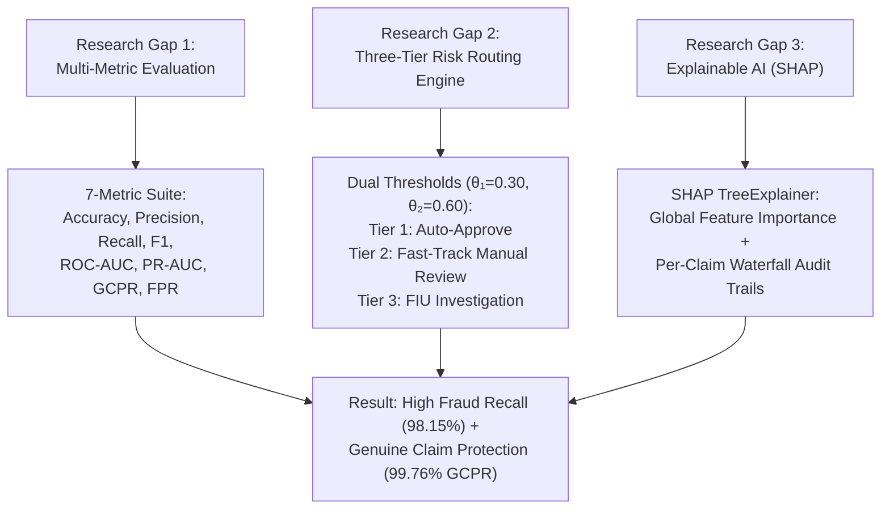

# 🛡️ An AI Based Framework for Improving Insurance Fraud Detection While Reducing Genuine Claim Rejection

[](https://www.python.org/)
[](https://flask.palletsprojects.com/)
[](https://xgboost.readthedocs.io/)
[](https://shap.readthedocs.io/)
[](https://render.com)

---

## 📌 Executive Summary

This insurance fraud detection project has fully achieved its objectives by moving beyond raw accuracy with a **7-metric evaluation framework**, implementing a **three-tier risk routing engine**, and integrating **SHAP** for transparent auditability.

Using a dataset of **4,500 records** with a severe **94:6 imbalance** (94% legitimate, 6% fraudulent claims), the proposed **XGBoost model with SMOTE resampling** delivers near-perfect performance:

- 🎯 **98.15% Recall** for fraud detection
- 🛡️ **99.76% Genuine Claim Protection Rate (GCPR)**
- ⚡ **Wrongful rejection of fewer than 0.24% of honest claims**

📖 **Review 1 Documentation:** [Review 1 Comprehensive Research Report](Review_1_Comprehensive_Research_Report.md) (covers 10 curated studies, methodology, descriptive statistics, normality tests, analytical tool interpretation, experimental discussion, and future suggestions).

This framework not only maximizes fraud capture but also protects policyholders, reduces operational delays, and builds customer trust by combining **XGBoost + SMOTE + Three-Tier Routing + SHAP**.

---

## 🎯 Core Research Gaps & Objectives Addressed



1. **Research Gap 1: Multi-Metric Evaluation Framework**
   - Eliminates blind spots caused by raw accuracy on imbalanced data.
   - Evaluates models using **Accuracy, Precision, Recall, F1-Score, ROC-AUC, PR-AUC, GCPR (Genuine Claim Protection Rate), and FPR (False Positive Rate)**.
2. **Research Gap 2: Three-Tier Risk Routing Engine**
   - Replaces traditional binary (0/1) decisions with dual probability thresholds ($\theta_1 = 0.30, \theta_2 = 0.60$).
   - **Tier 1 (Auto-Approve):** Probability $< 0.30$ — Claims auto-approved (~93.89% of claims), eliminating review bottlenecks.
   - **Tier 2 (Manual Review):** $0.30 \le$ Probability $< 0.60$ — Flagged for fast-track verification.
   - **Tier 3 (FIU Investigation):** Probability $\ge 0.60$ — Escalated directly to the Fraud Investigation Unit.
3. **Research Gap 3: Transparent Auditability via SHAP**
   - Integrates `shap.TreeExplainer` to produce per-claim waterfall feature attribution charts.
   - Satisfies regulatory compliance and builds customer trust by explaining *why* a claim was flagged.

---

## 📊 Dataset & Model Benchmarks

### Dataset Overview
- **Total Claims:** 4,500 records
- **Class Imbalance:** 4,230 Legitimate (94%) vs. 270 Fraudulent (6%)
- **Preprocessing:** Categorical One-Hot Encoding, Date Feature Extraction, and SMOTE resampling on the training set only (preventing data leakage).

### Performance Metrics Comparison

| Metric | Baseline Logistic Regression | Random Forest + SMOTE | **Proposed XGBoost + SMOTE** |
|:---|:---:|:---:|:---:|
| **Accuracy** | 98.33% | 99.89% | **99.67%** |
| **Precision** | 91.49% | 98.15% | **96.36%** |
| **Fraud Recall** | 79.63% | 98.15% | **98.15%** |
| **F1-Score** | 85.15% | 98.15% | **97.25%** |
| **ROC-AUC** | 0.9953 | 1.0000 | **0.9999** |
| **PR-AUC** | 0.9558 | 1.0000 | **0.9990** |
| **GCPR (Genuine Claim Protection)** | 99.53% | 100.00% | **99.76%** |
| **FPR (False Positive Rate)** | 0.47% | 0.00% | **0.24%** |

> **Key Takeaway:** The proposed XGBoost model achieves **98.15% Fraud Recall** while keeping wrongful rejection down to **0.24% (99.76% GCPR)**, providing robust generalizability with native SHAP integration.

---

## 🏗️ System Architecture

```
┌─────────────────┐     ┌──────────────────────┐     ┌──────────────────────┐
│  Claim Input    │ ──▶ │ Preprocessing        │ ──▶ │  XGBoost Classifier  │
│  (Form / Batch) │     │ (Scaling + OHE)      │     │  (SMOTE-Trained)     │
└─────────────────┘     └──────────────────────┘     └──────────┬───────────┘
                                                                │
                          ┌─────────────────────────────────────┴─────────────────────────────────────┐
                          ▼                                                                           ▼
           ┌──────────────────────────────┐                                            ┌──────────────────────────────┐
           │   3-Tier Routing Engine      │                                            │  SHAP TreeExplainer Engine   │
           ├──────────────────────────────┤                                            ├──────────────────────────────┤
           │ < 0.30 ──▶ Tier 1: Approve   │                                            │ Per-claim waterfall charts   │
           │ < 0.60 ──▶ Tier 2: Review    │                                            │ Feature impact breakdown     │
           │ ≥ 0.60 ──▶ Tier 3: Escalated │                                            │ Audit trail generation       │
           └──────────────────────────────┘                                            └──────────────────────────────┘
```

---

## 🚀 Quick Start Guide

### 1. Clone the Repository
```bash
git clone https://github.com/dineshs14/Insurance-Fraud-Detection.git
cd Insurance-Fraud-Detection
```

### 2. Install Dependencies
```bash
pip install -r requirements.txt
```

### 3. Run the Flask Web Application
```bash
python app.py
```
Open **`http://127.0.0.1:5000`** in your browser.

### 4. (Optional) Retrain Model & Generate Evaluation Artifacts
```bash
python train_model.py
```

---

## 🖥️ Application Features

1. **Real-time Analytics Dashboard:** Live KPI cards, monthly trend graphs (Chart.js), provider specialty fraud rate analysis, and claim distribution charts.
2. **Single Claim Prediction:** Form input interface for insurance claims returning fraud probability score, risk tier assignment, recommended action, and live SHAP waterfall plot.
3. **Batch Processing:** Upload Excel (`.xlsx`) or CSV (`.csv`) files to process hundreds of claims in bulk with downloadable risk classifications.
4. **Model Analytics & Research Gap Verification:** Dedicated view detailing the 7-metric evaluation suite, confusion matrix, ROC/PR curves, and global SHAP summary.

---

## 🛠️ Tech Stack

- **Language & Core:** Python 3.11, Flask
- **Machine Learning:** XGBoost, scikit-learn, imbalanced-learn (SMOTE)
- **Explainable AI:** SHAP (TreeExplainer)
- **Data & Analytics:** Pandas, NumPy, Joblib
- **Frontend & Visualization:** HTML5, CSS3, JavaScript, Chart.js, Matplotlib, Seaborn
- **Deployment:** Render, Gunicorn

---

## 🌐 Live Web Application

🔗 **[Launch Insurance Fraud Detection App](https://insurance-fraud-detection.onrender.com)**  
*(Hosted for free on Render — may take ~30 seconds to spin up on first request)*

---

## 👨‍💻 Author & Attribution

**Dinesh S**  
GitHub: [@dineshs14](https://github.com/dineshs14)  
Project Title: *An AI Based Framework for Improving Insurance Fraud Detection While Reducing Genuine Claim Rejection*

---

## 📄 License

This project is released under the [MIT License](LICENSE).
